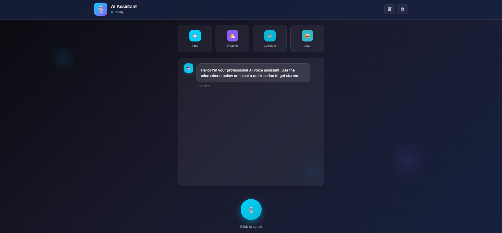
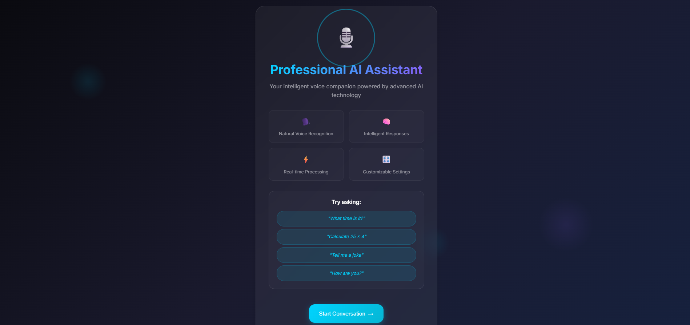
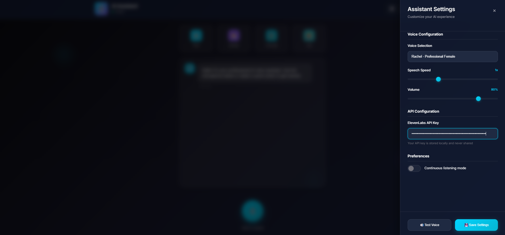
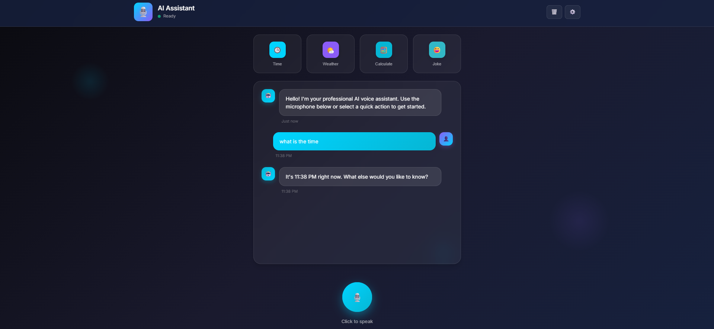

# Professional AI Voice Assistant

A web-based, modern AI voice assistant built with vanilla JavaScript, HTML and CSS, featuring real-time speech recognition and expressive ElevenLabs text-to-speech. Designed with a premium dark UI theme and smooth animations, this project delivers a futuristic and highly accessible voice experience in any modern browser.

---

## Features

- **Real-time speech recognition** using Web Speech API  
- **Expressive, natural voice replies** powered by ElevenLabs  
- **Polished, animated dark theme** with soft gradients and glassy effects  
- Well-organized **conversation chat panel** with avatars and timestamps  
- Professional **settings drawer** for voice, speed, volume and API key  
- Quick action commands for common tasks ([Time], [Weather], [Calculate], [Joke])  
- Responsive, accessible, and mobile-friendly interface  
- Seamless plug-and-play with ElevenLabs (bring your own API key)  

---

## Screenshots

| Welcome Page                              | Chat Experience                                 |
|--------------------------------------------|-------------------------------------------------|
|                         |                               |

| Settings Drawer                           | Voice Conversation Example                      |
|--------------------------------------------|-------------------------------------------------|
|                        |                             |

---

## Getting Started

### 1. Clone this repository
git clone https://github.com/FinoMaxwell/professional-ai-voice-assistant.git
cd professional-ai-voice-assistant

### 2. Run Locally
Use [Live Server](https://marketplace.visualstudio.com/items?itemName=ritwickdey.LiveServer) extension for VSCode  
or launch a static server like:

npx http-server .

Then open http://localhost:8080 in your browser.

### 3. Add Your ElevenLabs API Key
- Go to the settings panel (⚙️ in the top right)
- Paste your key under “ElevenLabs API Key”
- Enjoy lifelike voice responses instantly!

---

## License

Licensed under the MIT License.

---

**Note:**  
All screenshots in this README are taken from the actual project UI on Chrome.

